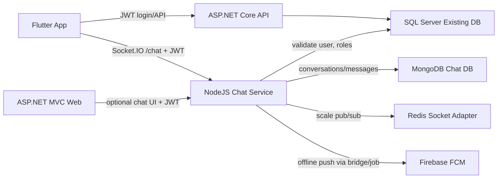
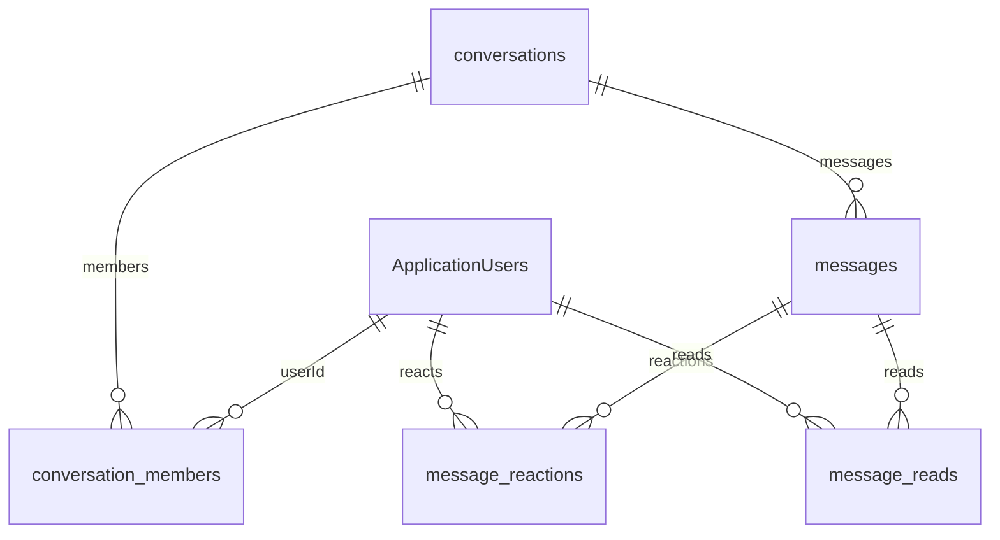

# DucAnh2025 Realtime Chat Architecture

## 1. Phan tich he thong hien tai

Project hien tai la ASP.NET Core MVC/API dung:

- `IdentityUser` cho dang nhap web cookie.
- JWT Bearer cho mobile/API, cau hinh trong `Program.cs` voi `Jwt:Issuer`, `Jwt:Audience`, `Jwt:Key`.
- Bang user nghiep vu rieng: `ApplicationUsers`.
- Bang session: `UserSessions`.
- Bang role: `Roles`, `UserRoles`, `RolePermissions`.
- Notification hien co: `FirebaseNotificationService`, `NotificationFireBases`, `UserFcmTokens`.
- Realtime hien co: SignalR `NotificationHub` tai `/notificationHub`.
- API pattern: `Controllers/API/*`, response dang `ApiResponse<T>`.

Chat module phai reuse:

- `ApplicationUsers.Id` lam `userId` chinh.
- JWT hien tai, khong tao auth moi.
- `CompanyId`, `GroupId`, `DepartmentId` de scope conversation.
- `Roles/UserRoles` cho admin/system permission.
- FCM token hien co cho push notification.

Khong co Flutter source trong workspace hien tai. Phan Flutter ben duoi la architecture va code mau de tich hop vao app mobile.

## A. Kien truc hoan chinh module chat

### System architecture



Khuyen nghi production:

- Giai doan dau: NodeJS chat service rieng, chay canh ASP.NET app.
- Auth dung shared JWT secret/config tu ASP.NET.
- SQL Server chi la identity/permission source.
- MongoDB luu chat data vi write-heavy, pagination theo message timeline tot hon SQL.
- Redis bat buoc khi scale nhieu Node instances.

### Backend architecture

```text
chat-service/
  src/auth          JWT validation against existing Jwt config
  src/db            Mongo + SQL Server connections
  src/models        Mongo schemas
  src/services      business logic, permission checks
  src/routes        REST API
  src/socket        Socket.IO namespace/gateway
```

### Flutter architecture

```text
lib/features/chat/
  data/
    datasources/chat_api.dart
    datasources/chat_socket_service.dart
    datasources/chat_local_db.dart
    models/chat_dto.dart
    repositories/chat_repository_impl.dart
  domain/
    entities/conversation.dart
    entities/message.dart
    repositories/chat_repository.dart
    usecases/send_message.dart
  presentation/
    bloc/conversation_list_cubit.dart
    bloc/chat_thread_cubit.dart
    widgets/message_bubble.dart
    widgets/chat_input.dart
```

### Realtime architecture

- Namespace: `/chat`.
- User room: `user:{userId}`.
- Conversation room: `conversation:{conversationId}`.
- Socket auth: verify JWT on connection, lookup `ApplicationUsers`.
- Join room: server checks `conversation_members` before joining.
- Redis adapter: sync rooms/events across Node instances.

## B. Database design

### MongoDB collections

#### conversations

```js
{
  _id,
  type: "private" | "group",
  title,
  avatarUrl,
  companyId,
  groupId,
  createdBy,
  lastMessageId,
  lastMessageAt,
  isActive,
  deletedAt,
  createdAt,
  updatedAt
}
```

Indexes:

- `{ companyId: 1, groupId: 1, lastMessageAt: -1 }`
- `{ type: 1 }`
- `{ isActive: 1 }`

#### conversation_members

```js
{
  _id,
  conversationId,
  userId,
  userName,
  role: "owner" | "admin" | "member",
  mutedUntil,
  joinedAt,
  lastReadMessageId,
  lastReadAt,
  isActive,
  removedAt
}
```

Indexes:

- unique `{ conversationId: 1, userId: 1 }`
- `{ userId: 1, isActive: 1, updatedAt: -1 }`
- `{ conversationId: 1, role: 1 }`

#### messages

```js
{
  _id,
  conversationId,
  clientMessageId,
  senderId,
  senderUserName,
  body,
  type: "text" | "image" | "file" | "voice" | "system",
  replyToMessageId,
  attachments: [{ type, url, fileName, mimeType, size, durationMs }],
  mentionedUserIds,
  pinnedAt,
  editedAt,
  recalledAt,
  deletedForUserIds,
  isActive,
  createdAt,
  updatedAt
}
```

Indexes:

- `{ conversationId: 1, createdAt: -1, _id: -1 }`
- unique `{ conversationId: 1, clientMessageId: 1, senderId: 1 }`
- text `{ body: "text" }`
- `{ mentionedUserIds: 1 }`

#### message_reactions

```js
{ messageId, conversationId, userId, emoji, isActive, createdAt, updatedAt }
```

Indexes:

- unique `{ messageId: 1, userId: 1, emoji: 1 }`
- `{ conversationId: 1, messageId: 1 }`

#### message_reads

```js
{ conversationId, messageId, userId, readAt }
```

Indexes:

- unique `{ conversationId: 1, userId: 1, messageId: 1 }`
- `{ conversationId: 1, userId: 1, readAt: -1 }`

#### online_users

```js
{ userId, socketId, companyId, groupId, lastSeenAt, expiresAt }
```

Indexes:

- unique `{ socketId: 1 }`
- `{ userId: 1 }`
- TTL `{ expiresAt: 1 }`

#### notifications

Co the dung lai SQL `NotificationFireBases` cho push/in-app notification. Neu chat can notification nhanh rieng trong Mongo:

```js
{ userId, type, title, body, conversationId, messageId, isRead, createdAt }
```

Indexes:

- `{ userId: 1, isRead: 1, createdAt: -1 }`

### ERD



### Pagination strategy

- Conversations: cursor by `lastMessageAt`.
- Messages: cursor by `_id` or `createdAt + _id`.
- Query latest messages: sort `{ _id: -1 }`, reverse client-side before render.
- Do not use large `skip` for message timelines.

## C. API documentation

Base URL: `/api/chat`

All REST APIs use existing JWT:

```http
Authorization: Bearer {aspnet_jwt}
```

### Conversations

`GET /api/chat/conversations?limit=30&before=2026-05-22T00:00:00Z`

Response:

```json
{
  "success": true,
  "data": [
    {
      "_id": "conversationId",
      "type": "private",
      "lastMessageAt": "2026-05-22T10:00:00.000Z"
    }
  ]
}
```

`POST /api/chat/conversations/private`

```json
{
  "targetUserId": "existing-application-user-id",
  "targetUserName": "user@company.com"
}
```

`POST /api/chat/conversations/group`

```json
{
  "title": "Phong ky thuat",
  "members": [
    { "userId": "id-1", "userName": "a@company.com" }
  ]
}
```

`GET /api/chat/conversations/{id}/messages?limit=30&before={messageObjectId}`

### Message management

Nen them tiep:

- `PUT /api/chat/messages/{id}` edit message.
- `POST /api/chat/messages/{id}/recall` recall message.
- `DELETE /api/chat/messages/{id}` soft delete for current user.
- `POST /api/chat/messages/{id}/pin` pin message.
- `POST /api/chat/messages/{id}/reactions`.
- `DELETE /api/chat/messages/{id}/reactions/{emoji}`.

### Group management

- `PATCH /api/chat/conversations/{id}` update title/avatar/settings.
- `POST /api/chat/conversations/{id}/members`.
- `DELETE /api/chat/conversations/{id}/members/{userId}`.
- `PATCH /api/chat/conversations/{id}/members/{userId}/role`.

Admin permission:

- Owner can do all.
- Admin can add/remove member and update group metadata.
- Member can read/send only.

### Upload

- `POST /api/chat/uploads`
- Use multipart, max size by file type.
- Store local first or object storage/CDN in production.
- Persist attachments inside message document or separate collection if file lifecycle is complex.

### Socket events

Client emits:

- `conversation:join`
- `conversation:leave`
- `message:send`
- `message:seen`
- `message:typing`
- `message:reaction:add`
- `message:reaction:remove`

Server emits:

- `message:new`
- `message:delivered`
- `message:seen`
- `message:typing`
- `message:updated`
- `message:recalled`
- `group:update`
- `presence:online`
- `presence:offline`
- `notification:new`

Event naming convention:

```text
domain:action
message:send
message:new
conversation:join
presence:online
```

## D. Source structure de xuat

### Backend NodeJS

Da them skeleton:

```text
chat-service/
  package.json
  tsconfig.json
  .env.example
  src/
    auth/jwt.ts
    config/env.ts
    db/mongo.ts
    db/sql.ts
    models/conversation.model.ts
    models/message.model.ts
    models/presence.model.ts
    routes/chat.routes.ts
    services/chat.service.ts
    socket/chat.gateway.ts
    server.ts
```

### Flutter

```text
lib/features/chat/
  data/datasources/chat_api.dart
  data/datasources/chat_socket_service.dart
  data/datasources/chat_local_db.dart
  data/models/conversation_dto.dart
  data/models/message_dto.dart
  data/repositories/chat_repository_impl.dart
  domain/entities/conversation.dart
  domain/entities/message.dart
  domain/repositories/chat_repository.dart
  presentation/bloc/chat_thread_cubit.dart
  presentation/bloc/conversation_list_cubit.dart
  presentation/pages/chat_list_page.dart
  presentation/pages/chat_thread_page.dart
  presentation/widgets/message_bubble.dart
  presentation/widgets/chat_input.dart
```

## E. Development roadmap

### Phase 1: Core chat backend

- Add Node service deployment.
- Configure shared JWT env from ASP.NET.
- Connect MongoDB.
- Connect SQL Server identity lookup.
- Implement Socket.IO auth and rooms.
- Implement private conversation + message send/list.

### Phase 2: Private chat

- Conversation list.
- Message pagination.
- Optimistic UI.
- Delivered/seen.
- Typing.
- Online/offline.

### Phase 3: Group chat

- Create group.
- Owner/admin/member roles.
- Add/remove member.
- Group avatar/settings.
- Mention users.
- Read receipt per member.

### Phase 4: Notification realtime

- Emit `notification:new`.
- Persist notifications or bridge to existing `FirebaseNotificationService`.
- Push FCM for offline recipients.
- Badge unread count.

### Phase 5: Optimization & scaling

- Redis adapter.
- Rate limiting.
- Message dedup by `clientMessageId`.
- Attachment scanning/CDN.
- Mongo indexes review.
- Observability: logs, metrics, traces.

## F. Code mau production-ready

### Socket auth middleware

File: `chat-service/src/auth/jwt.ts`

```ts
const payload = jwt.verify(token, env.JWT_KEY, {
  issuer: env.JWT_ISSUER,
  audience: env.JWT_AUDIENCE
}) as jwt.JwtPayload;

const userName = String(payload[nameClaim] ?? payload.unique_name ?? payload.sub ?? '');
const user = await findExistingUserByUserName(userName);
socket.data.user = user;
```

### Message schema

File: `chat-service/src/models/message.model.ts`

```ts
messageSchema.index({ conversationId: 1, createdAt: -1, _id: -1 });
messageSchema.index({ conversationId: 1, clientMessageId: 1, senderId: 1 }, { unique: true });
```

### Chat service

File: `chat-service/src/services/chat.service.ts`

```ts
await this.assertMember(input.conversationId, actor.id);
const message = await Message.create({
  conversationId: input.conversationId,
  clientMessageId: input.clientMessageId,
  senderId: actor.id,
  senderUserName: actor.userName,
  body: input.body ?? ''
});
```

### Socket gateway

File: `chat-service/src/socket/chat.gateway.ts`

```ts
nsp.use(socketAuth);
socket.on('conversation:join', async ({ conversationId }, ack) => {
  await chat.assertMember(conversationId, user.id);
  socket.join(`conversation:${conversationId}`);
  ack?.({ success: true });
});
```

### Flutter socket service

```dart
class ChatSocketService {
  late final IO.Socket _socket;

  void connect(String token) {
    _socket = IO.io(
      '$baseChatUrl/chat',
      IO.OptionBuilder()
          .setTransports(['websocket'])
          .setAuth({'token': token})
          .enableReconnection()
          .setReconnectionAttempts(999999)
          .setReconnectionDelay(500)
          .build(),
    );
  }

  void joinConversation(String conversationId) {
    _socket.emitWithAck('conversation:join', {'conversationId': conversationId});
  }

  void sendMessage(MessageDraft draft, void Function(dynamic ack) onAck) {
    _socket.emitWithAck('message:send', draft.toJson(), ack: onAck);
  }

  Stream<Message> onNewMessage() {
    final controller = StreamController<Message>.broadcast();
    _socket.on('message:new', (data) => controller.add(Message.fromJson(data)));
    return controller.stream;
  }
}
```

### Optimistic UI example

```dart
Future<void> send(String text) async {
  final temp = Message.optimistic(
    clientMessageId: const Uuid().v4(),
    body: text,
    createdAt: DateTime.now(),
  );

  emit(state.copyWith(messages: [...state.messages, temp]));

  repository.sendMessage(temp).then((serverMessage) {
    final next = state.messages.map((m) {
      return m.clientMessageId == temp.clientMessageId ? serverMessage : m;
    }).toList();
    emit(state.copyWith(messages: next));
  }).catchError((_) {
    emit(state.markFailed(temp.clientMessageId));
  });
}
```

## Security & performance checklist

- Validate JWT on every socket connection.
- Re-check membership before join/send/typing/seen.
- Never trust client-provided `senderId`.
- Use `clientMessageId` for idempotency.
- Rate limit `message:send` per user/conversation.
- Escape/sanitize message body before web render.
- Scan uploads and restrict MIME/size.
- Store only metadata in Mongo, file content in object storage/CDN.
- Use Mongo cursor pagination.
- Use Redis adapter before horizontal scale.
- Send offline push only after checking online presence.
- Keep SQL reads minimal: JWT validation + profile/role lookup cache.
