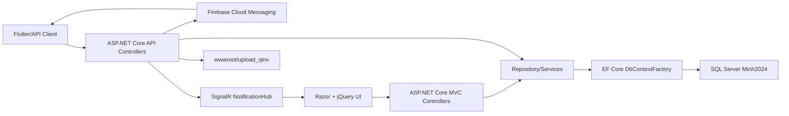
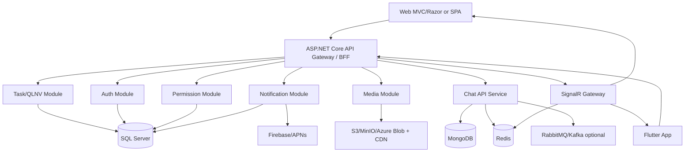
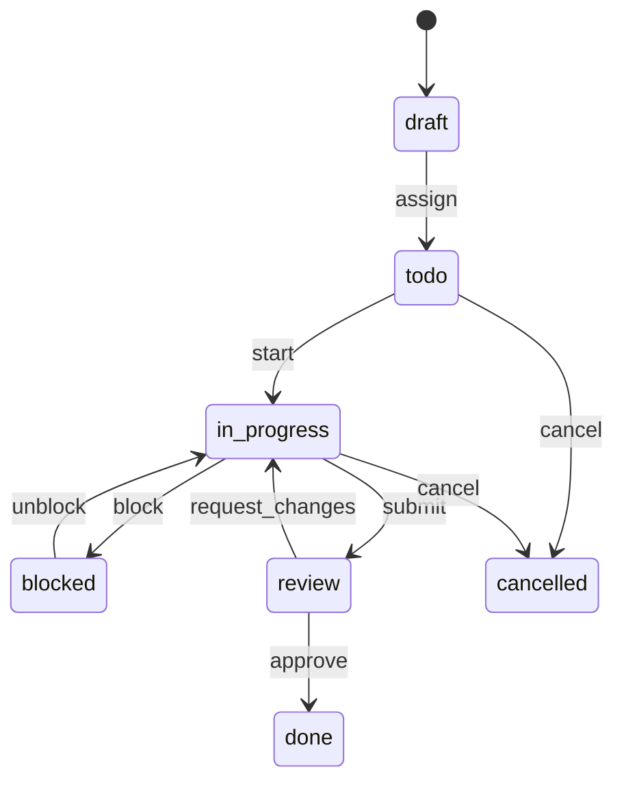
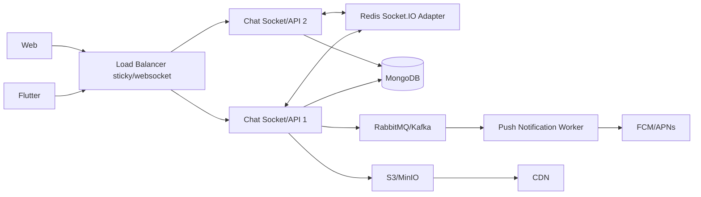

# Technical Architecture Document & Development Roadmap

Du an hien tai la ASP.NET Core MVC/API monolith chay .NET 9, dung SQL Server qua Entity Framework Core, Identity cookie cho web, JWT Bearer cho mobile/API, SignalR cho notification, Firebase Cloud Messaging cho push notification, va frontend chu yeu la Razor Views + jQuery/DataTables/Select2.

Tai lieu nay tap trung vao Accounts / Authentication / Authorization, QLNV, phan quyen, quy trinh giao viec, realtime, chat, Flutter mobile integration va chien luoc production-ready cho muc tieu scale len hang chuc nghin user.

## 1. Current Architecture Assessment

### 1.1 Source Code Structure

So luong thanh phan dang doc duoc:

- `Controllers`: 92 file controller.
- `Models`: 98 file model.
- `Repository`: 85 interface repository.
- `Services`: 96 implementation/service file.
- Frontend: Razor Views + JavaScript trong `wwwroot/js`.
- Static/vendor assets nam trong `wwwroot`, bao gom ca sample theme HTML va thu vien frontend.

Structure hien tai:

```text
DucAnh2025/
  Controllers/
    API/
      QLNV/
      NhanSu/
      Kho/
      HeThong/
    AccountController.cs
    ManageAccountController.cs
  Data/
    ApplicationDbContext.cs
  Models/
    Accounts/
    QLNV/
    HeThong/
    NhanSu/
    Kho/
  Repository/
    I*.cs
  Services/
    *Repository.cs
    SignalR/
  ViewModels/
  Views/
  wwwroot/
    js/
    upload_qlnv/
```

Nhan xet:

- Ung dung da co phan tach Controller / Model / Repository / ViewModel, nhung chua phan tach theo bounded context. Module business bi trai ngang qua nhieu folder.
- `Program.cs` dang gan qua nhieu registration DI thu cong, tro thanh composition root rat lon.
- `ApplicationDbContext` chua co modular EF configuration, tat ca `DbSet` dat chung trong mot class lon.
- Repository dang dong vai tro vua query, vua command, vua mapping ViewModel, vua rule nghiep vu nhe.
- Frontend state management la bien global + jQuery event, khong co typed client/service layer.

### 1.2 Current Runtime Architecture



### 1.3 Authentication Flow

Dang co 2 scheme:

- Web: ASP.NET Core Identity cookie (`Identity.Application`).
- API/mobile: JWT Bearer scheme ten `JwtBearer`.

Flow mobile/API hien tai:

1. Client goi `POST /api/User/Login`.
2. Server tim `IdentityUser` theo email/username, check password.
3. Server check `ApplicationUser.IsActive`.
4. Server tao verification code/email nhung van tra JWT ngay sau password check.
5. JWT gom `sub`, `jti`, `ClaimTypes.Name`, expire 7 ngay.
6. API QLNV dung `[Authorize(AuthenticationSchemes = "JwtBearer")]`.

Rui ro:

- JWT secret va connection string dang hardcode trong `appsettings.json`. Khong dat trong Secret Manager / env / vault.
- Khong co refresh token, revoke token, device session, token rotation.
- JWT 7 ngay la dai voi access token; nen tach access token 15 phut va refresh token 7-30 ngay.
- Claim chua co `userId`, `groupId`, `companyId`, role/permission version. Nhieu API lay `groupId`, `userName` tu query/body client gui len, de bi horizontal privilege escalation neu khong verify server-side.
- `UseAuthentication()` va `UseAuthorization()` duoc goi 2 lan trong pipeline.
- QR login session dung `IMemoryCache`, khong scale duoc multi-instance.

### 1.4 Authorization / Permission

Dang co 2 co che:

- ASP.NET Identity role co `Role`, `UserRole`, `RolePermission`.
- Custom permission theo `MajorUserPermission`, `Permission`, `Major`, `DayInWeek`, `GroupId`, `CompanyId`.

Nhan xet:

- Custom permission linh hoat theo module/ngay trong tuan, phu hop ERP.
- Tuy nhien permission checking chua duoc enforce dong deu o QLNV. Nhieu endpoint QLNV chi co JWT, khong co policy/permission middleware.
- Permission ID dang hardcode o nhieu controller khac. Day la technical debt lon vi kho audit, kho test, kho migrate.
- Nen chuan hoa thanh policy-based authorization voi permission code co y nghia, vi du `qlnv.task.create`, `qlnv.task.assign`, `qlnv.task.comment`.

### 1.5 QLNV Current Model

Bang chinh:

- `QLNV_CongViecs`: task cha.
- `QLNV_CongViecCons`: subtask.
- `QLNV_NhanVienThucHiens`: assignee mapping.
- `QLNV_DanhGias`: danh gia task.
- `QLNV_ThemNgays`: gia han task lien quan.
- `QLNV_NhanViens`, `QLNV_NhomNhanViens`, `QLNV_QuanLyNhanViens`: nhan vien, nhom, quan ly nhom.

Task hien tai co cac truong: nguoi giao viec, nhom cong viec, ngay bat dau/ket thuc, muc do uu tien, tien do 0-10, lap lai, ten/noi dung, file dinh kem, company/group, approval metadata, `IsActive`, `IsStatus`.

Rui ro thiet ke:

- Khong co `Status` typed enum rieng (`todo`, `in_progress`, `review`, `done`, `blocked`, `cancelled`).
- `TienDo` dang thay the workflow status, khong du cho board/Kanban.
- File dinh kem la string tren task/subtask, chua co table attachment rieng.
- Chua co comment, mention, watcher, activity timeline, event table.
- Delete that su bang `Remove`, trong khi model co `IsActive`. Mat audit trail.
- Update task dang co flow xoa ban ghi cu va insert lai, de mat relationship va activity.
- Repository query co cho load all child task truoc roi filter tren client. Khi data lon se nghen.
- Chua co optimistic concurrency (`RowVersion`), nen canh bao concurrency bang `CreateAt` khong du.

### 1.6 API Flow

Pattern hien tai:

- Route dang la `api/[controller]`.
- Response thuong dung `ApiResponse<T>`.
- Nhieu truong hop loi business van return HTTP 200.
- CRUD naming chua RESTful, vi du `CreateCongViec`, `UpdateCongViec`, `GetByVM`, `InsertCVC`.
- Pagination/filtering chua chuan hoa, mot so query tra full list.
- Client thuong goi `GetJwtToken` de lay token roi moi goi API, tao overhead.

### 1.7 Realtime Current State

Dang co:

- `NotificationHub` voi `SendMessage`.
- `SignalRNotificationService.SendToUser(s)` gui `ReceiveNotification`.
- Frontend connect `/notificationHub` va listen `ReceiveNotification`.
- Push notification qua Firebase.

Thieu:

- Hub authentication mapping chuan user ID.
- Group/room theo task, project, company.
- Online/offline, typing, comment/task update event.
- Backplane Redis cho multi-instance.
- Reconnect/resync strategy.

### 1.8 Bottlenecks & Technical Debt

High impact:

- Single SQL Server schema + monolithic DbContext lon.
- Local file storage trong `wwwroot/upload_qlnv`, khong scale horizontal.
- SignalR in-memory, khong co Redis backplane.
- Fire-and-forget `Task.Run` trong request path de gui notification. Khi process recycle, job co the mat; exception kho trace.
- Permission khong enforce dong nhat, client truyen `groupId/userName`.
- Hardcoded secrets.
- Query list full + filter in-memory o mot so cho.
- No standardized logging/metrics/tracing.
- No migration folder/doc CI/CD trong source hien tai.

## 2. Proposed Target Architecture

### 2.1 Recommended Architecture

Giai doan ngan han nen giu modular monolith, khong tach microservice som. Tach module theo bounded context truoc; chat/realtime co the thanh service rieng khi traffic cao.



### 2.2 Target Folder Structure

```text
src/
  DucAnh.Web/
    Controllers/
    Views/
    wwwroot/
  DucAnh.Api/
    Program.cs
    Middlewares/
    Filters/
  DucAnh.Application/
    Common/
      Behaviors/
      Contracts/
      Security/
      Validation/
    Auth/
    QLNV/
      Commands/
      Queries/
      DTOs/
      Policies/
      Events/
    Notifications/
    Media/
  DucAnh.Domain/
    Common/
    Accounts/
    QLNV/
    Permissions/
  DucAnh.Infrastructure/
    Persistence/
      ApplicationDbContext.cs
      Configurations/
      Migrations/
    Identity/
    Realtime/
    Firebase/
    Storage/
    BackgroundJobs/
  DucAnh.Chat.Api/
  DucAnh.Chat.Domain/
  DucAnh.Chat.Infrastructure/
tests/
  DucAnh.UnitTests/
  DucAnh.IntegrationTests/
```

### 2.3 Design Patterns

- Modular Monolith + Clean Architecture.
- CQRS nhe cho QLNV: Commands mutate state, Queries toi uu read model.
- Domain events cho task/comment/activity/notification.
- Repository chi nen la persistence abstraction; business rule dat trong application/domain service.
- Unit of Work per request/command.
- Outbox pattern cho notification/realtime event.
- Policy-based authorization.
- Specification pattern cho filter task/list.
- Optimistic concurrency bang `rowversion`.

## 3. QLNV Redesign

### 3.1 Target Task Workflow

Trang thai de xuat:

- `draft`: dang soan.
- `todo`: da giao/chua bat dau.
- `in_progress`: dang lam.
- `blocked`: bi chan.
- `review`: cho nguoi giao viec review.
- `done`: hoan thanh.
- `cancelled`: huy.

Workflow:



### 3.2 SQL Database Design for QLNV

Core tables:

```sql
Tasks(
  Id uniqueidentifier primary key,
  GroupId uniqueidentifier not null,
  CompanyId uniqueidentifier not null,
  ProjectId uniqueidentifier null,
  BoardId uniqueidentifier null,
  ParentTaskId uniqueidentifier null,
  TaskKey nvarchar(50) not null,
  Title nvarchar(300) not null,
  Description nvarchar(max) null,
  Status varchar(30) not null,
  Priority varchar(20) not null,
  StartDate datetime2 null,
  DueDate datetime2 null,
  Progress decimal(5,2) not null default 0,
  CreatedBy uniqueidentifier not null,
  UpdatedBy uniqueidentifier null,
  CreatedAt datetime2 not null,
  UpdatedAt datetime2 null,
  DeletedAt datetime2 null,
  RowVersion rowversion not null
)

TaskAssignees(
  TaskId uniqueidentifier not null,
  UserId uniqueidentifier not null,
  AssignedBy uniqueidentifier not null,
  AssignedAt datetime2 not null,
  Role varchar(30) null,
  primary key(TaskId, UserId)
)

TaskWatchers(
  TaskId uniqueidentifier not null,
  UserId uniqueidentifier not null,
  CreatedAt datetime2 not null,
  primary key(TaskId, UserId)
)

TaskComments(
  Id uniqueidentifier primary key,
  TaskId uniqueidentifier not null,
  ParentCommentId uniqueidentifier null,
  AuthorId uniqueidentifier not null,
  Body nvarchar(max) not null,
  BodyFormat varchar(20) not null default 'markdown',
  IsEdited bit not null default 0,
  CreatedAt datetime2 not null,
  UpdatedAt datetime2 null,
  DeletedAt datetime2 null,
  RowVersion rowversion not null
)

TaskCommentMentions(
  CommentId uniqueidentifier not null,
  MentionedUserId uniqueidentifier not null,
  primary key(CommentId, MentionedUserId)
)

TaskAttachments(
  Id uniqueidentifier primary key,
  TaskId uniqueidentifier null,
  CommentId uniqueidentifier null,
  UploaderId uniqueidentifier not null,
  FileName nvarchar(260) not null,
  ContentType varchar(120) not null,
  SizeBytes bigint not null,
  StorageKey nvarchar(500) not null,
  PublicUrl nvarchar(1000) null,
  Checksum varchar(128) null,
  CreatedAt datetime2 not null,
  DeletedAt datetime2 null
)

TaskActivityLogs(
  Id uniqueidentifier primary key,
  TaskId uniqueidentifier not null,
  ActorId uniqueidentifier not null,
  EventType varchar(80) not null,
  FieldName varchar(100) null,
  OldValue nvarchar(max) null,
  NewValue nvarchar(max) null,
  MetadataJson nvarchar(max) null,
  CreatedAt datetime2 not null
)
```

Indexes:

```sql
create index IX_Tasks_Group_Status_DueDate on Tasks(GroupId, Status, DueDate) where DeletedAt is null;
create index IX_Tasks_Group_Assignee on TaskAssignees(UserId, TaskId);
create index IX_Comments_Task_CreatedAt on TaskComments(TaskId, CreatedAt) where DeletedAt is null;
create index IX_Activity_Task_CreatedAt on TaskActivityLogs(TaskId, CreatedAt desc);
create index IX_Attachments_Task on TaskAttachments(TaskId) where DeletedAt is null;
```

### 3.3 Comment System

Capabilities:

- Comment root va reply.
- Mention `@user`.
- Attach file/image.
- Edit/delete soft delete.
- Realtime event.
- Notification cho assignee/watcher/mentioned users.

Permission:

- `task.comment.create`: assignee, creator, watcher co quyen comment.
- `task.comment.update`: author trong thoi gian cho phep hoac admin.
- `task.comment.delete`: author/admin/task owner.
- Mention chi cho user cung `GroupId/CompanyId` va co visibility voi task.

API:

```http
GET    /api/v1/tasks/{taskId}/comments?cursor=&limit=30
POST   /api/v1/tasks/{taskId}/comments
PATCH  /api/v1/tasks/{taskId}/comments/{commentId}
DELETE /api/v1/tasks/{taskId}/comments/{commentId}
POST   /api/v1/tasks/{taskId}/comments/{commentId}/attachments
```

Request:

```json
{
  "body": "Can @user-123 review file nay?",
  "parentCommentId": null,
  "mentions": ["user-123"],
  "clientRequestId": "uuid-from-mobile"
}
```

Realtime events:

- `task.comment.created`
- `task.comment.updated`
- `task.comment.deleted`
- `task.comment.attachment_added`

### 3.4 Activity Log / Timeline

Dung event sourcing nhe:

- Khong dung event store lam source of truth.
- Moi command update task tao `TaskActivityLog`.
- Luu before/after cho field quan trong: status, priority, due date, assignee, title, progress, attachment, comment.
- Query timeline doc tu `TaskActivityLogs` + comments.

Timeline UI:

- Render theo ngay.
- Group event gan nhau trong 1 phien user.
- Comment la timeline item rieng.
- Activity item compact: actor, action, field, old/new, timestamp.

### 3.5 Realtime Task Architecture

ASP.NET Core nen tiep tuc dung SignalR cho QLNV neu backend chinh la .NET. Neu chat dung NodeJS/Socket.IO thi co 2 realtime gateway: SignalR cho ERP/task, Socket.IO cho chat.

Scale SignalR:

- Add Redis backplane: `AddSignalR().AddStackExchangeRedis(...)`.
- Group naming:
  - `tenant:{groupId}`
  - `task:{taskId}`
  - `user:{userId}`
  - `board:{boardId}`
- Client khi mo task detail join `task:{taskId}`.
- Client khi vao board join `board:{boardId}`.

Event naming:

```text
task.created
task.updated
task.status_changed
task.assignee_added
task.assignee_removed
task.comment.created
task.activity.created
notification.created
presence.user_online
presence.user_offline
typing.started
typing.stopped
```

Reconnect strategy:

- Client reconnect tu dong.
- Sau reconnect goi `GET /api/v1/sync?since=lastEventId`.
- Server gan `eventId` tang dan vao outbox/realtime events.
- Mobile luu `lastEventId` local.

## 4. Realtime Chat System

### 4.1 Service Boundary

Khuyen nghi tach `Chat Service` rieng khi:

- Tin nhan > 1 trieu/thang.
- Can retention/search/media rieng.
- Can scale socket/doc lap voi ERP.

Giai doan dau co the deploy cung monorepo, process rieng:

- `DucAnh.Chat.Api`: NodeJS NestJS/Express + Socket.IO.
- MongoDB luu chat.
- Redis pub/sub + socket adapter.
- RabbitMQ/Kafka optional cho notification, indexing, moderation.

### 4.2 Chat Architecture



### 4.3 MongoDB Schema

`conversations`:

```json
{
  "_id": "ObjectId",
  "type": "direct|group",
  "tenantId": "groupId",
  "title": "string",
  "avatarUrl": "string",
  "memberIds": ["userId"],
  "admins": ["userId"],
  "lastMessage": {
    "messageId": "ObjectId",
    "senderId": "userId",
    "textPreview": "string",
    "createdAt": "date"
  },
  "settings": {
    "onlyAdminCanInvite": false,
    "muteDefault": false
  },
  "createdBy": "userId",
  "createdAt": "date",
  "updatedAt": "date",
  "deletedAt": null
}
```

`messages`:

```json
{
  "_id": "ObjectId",
  "tenantId": "groupId",
  "conversationId": "ObjectId",
  "senderId": "userId",
  "type": "text|image|file|voice|system",
  "body": "string",
  "replyToMessageId": "ObjectId|null",
  "mentions": ["userId"],
  "attachments": [
    {
      "attachmentId": "ObjectId",
      "fileName": "a.png",
      "contentType": "image/png",
      "sizeBytes": 12345,
      "url": "https://cdn/...",
      "durationMs": 0
    }
  ],
  "pinnedBy": ["userId"],
  "recalledAt": null,
  "deletedFor": ["userId"],
  "createdAt": "date",
  "updatedAt": "date"
}
```

`message_status`:

```json
{
  "_id": "ObjectId",
  "messageId": "ObjectId",
  "conversationId": "ObjectId",
  "userId": "userId",
  "deliveredAt": "date|null",
  "seenAt": "date|null"
}
```

`users_online`:

```json
{
  "_id": "userId",
  "tenantId": "groupId",
  "socketIds": ["socketId"],
  "lastSeenAt": "date",
  "status": "online|offline"
}
```

`notifications`:

```json
{
  "_id": "ObjectId",
  "tenantId": "groupId",
  "recipientId": "userId",
  "type": "chat.message|chat.mention|task.comment|task.assigned",
  "title": "string",
  "body": "string",
  "target": {
    "kind": "conversation|task",
    "id": "string"
  },
  "isRead": false,
  "createdAt": "date",
  "readAt": null
}
```

### 4.4 MongoDB Index Strategy

```js
db.conversations.createIndex({ tenantId: 1, memberIds: 1, updatedAt: -1 })
db.conversations.createIndex({ tenantId: 1, type: 1, memberIds: 1 })
db.messages.createIndex({ conversationId: 1, createdAt: -1 })
db.messages.createIndex({ tenantId: 1, senderId: 1, createdAt: -1 })
db.messages.createIndex({ conversationId: 1, _id: -1 })
db.message_status.createIndex({ messageId: 1, userId: 1 }, { unique: true })
db.message_status.createIndex({ conversationId: 1, userId: 1, seenAt: -1 })
db.users_online.createIndex({ lastSeenAt: 1 }, { expireAfterSeconds: 86400 })
db.notifications.createIndex({ recipientId: 1, isRead: 1, createdAt: -1 })
db.notifications.createIndex({ createdAt: 1 }, { expireAfterSeconds: 15552000 })
```

Pagination:

- Dung cursor pagination theo `_id` hoac `createdAt`.
- API: `GET /conversations/{id}/messages?before=<messageId>&limit=30`.
- Khong dung skip/limit cho deep scroll.

### 4.5 Chat REST API

```http
GET    /api/v1/chat/conversations
POST   /api/v1/chat/conversations/direct
POST   /api/v1/chat/conversations/group
GET    /api/v1/chat/conversations/{id}
PATCH  /api/v1/chat/conversations/{id}
POST   /api/v1/chat/conversations/{id}/members
DELETE /api/v1/chat/conversations/{id}/members/{userId}

GET    /api/v1/chat/conversations/{id}/messages?before=&limit=30
POST   /api/v1/chat/conversations/{id}/messages
PATCH  /api/v1/chat/messages/{id}
POST   /api/v1/chat/messages/{id}/recall
DELETE /api/v1/chat/messages/{id}
POST   /api/v1/chat/messages/{id}/pin
DELETE /api/v1/chat/messages/{id}/pin
POST   /api/v1/chat/uploads/presign
```

Socket.IO events:

```text
conversation.join
conversation.leave
message.send
message.created
message.delivered
message.seen
message.recalled
message.deleted
message.pinned
typing.start
typing.stop
presence.online
presence.offline
notification.created
```

## 5. Professional API Standard

### 5.1 Naming Convention

- Versioned REST route: `/api/v1/...`
- Resource plural: `/tasks`, `/task-comments`, `/notifications`.
- Command endpoint chi khi action khong phai CRUD: `/tasks/{id}/submit`, `/tasks/{id}/approve`.
- Query params cho filter/paging/sort.

### 5.2 Response Structure

```json
{
  "success": true,
  "data": {},
  "meta": {
    "requestId": "uuid",
    "cursor": "next-cursor"
  }
}
```

Error:

```json
{
  "success": false,
  "error": {
    "code": "TASK_NOT_FOUND",
    "message": "Task not found",
    "details": {}
  },
  "meta": {
    "requestId": "uuid"
  }
}
```

HTTP status:

- `200`: read/update success.
- `201`: created.
- `204`: deleted/no content.
- `400`: validation/business input error.
- `401`: unauthenticated.
- `403`: unauthorized.
- `404`: not found.
- `409`: concurrency/conflict.
- `422`: domain validation.
- `429`: rate limit.
- `500`: server error.

### 5.3 Middleware / Filters

- Exception handling middleware.
- Request correlation ID.
- Authentication.
- Tenant resolver: resolve `GroupId/CompanyId` tu JWT/session, khong tin query client.
- Permission middleware/policy.
- Validation filter (FluentValidation).
- Rate limiting.
- Audit logging.
- Response compression.
- Serilog request logging.

## 6. Security Strategy

Immediate fixes:

- Move connection string/JWT key/Firebase service account ra env/vault.
- Rotate JWT secret hien tai.
- Access token 15 phut; refresh token rotation + revoke.
- JWT claims can co `sub=userId`, `username`, `groupId`, `companyId`, `permissionVersion`.
- Validate `groupId/companyId` server-side.
- Enforce permission policy tren QLNV endpoints.
- Bat anti-forgery token cho form MVC.
- CSP, HSTS, secure cookie, SameSite.
- Upload security: allowlist content type, extension validation, magic byte scan, max size theo loai file, virus scan, storage ngoai webroot.
- Logging khong ghi password/token/PII nhay cam.
- Rate limit login, upload, comment, message send.
- CSRF: cookie endpoints phai co antiforgery; API Bearer token khong dung cookie auth.
- XSS: encode comment/render markdown sanitized.
- SQL: dung parameterized EF, them indexes, khong filter in-memory tren dataset lon.

## 7. Performance & Scalability

Database:

- Them index theo `GroupId`, `CompanyId`, `IsActive/DeletedAt`, `CreatedAt`, `DueDate`, `Status`.
- Read query dung projection DTO, khong load entity day du.
- Cursor pagination cho task/comment/chat/notification.
- Tach read model cho dashboard reports.
- Background aggregation cho dashboard neu data lon.

Cache:

- Redis cache permission theo `userId:permissionVersion`.
- Cache danh muc it thay doi.
- Invalidate khi permission/role thay doi.

Background processing:

- Hangfire/Quartz/Worker Service cho email/FCM/notification/outbox.
- Outbox table:
  - `OutboxMessages(Id, Type, PayloadJson, Status, RetryCount, CreatedAt, ProcessedAt)`.

Horizontal scaling:

- API stateless.
- Session/token/QR cache dua vao Redis.
- SignalR Redis backplane.
- File storage dua vao object storage.
- DB connection pooling.
- Load balancer websocket support.

## 8. Flutter Mobile Integration

Feature-first Clean Architecture:

```text
lib/
  core/
    network/
    auth/
    storage/
    socket/
    error/
    widgets/
  features/
    auth/
      data/
      domain/
      presentation/
    tasks/
      data/
      domain/
      presentation/
    chat/
      data/
      domain/
      presentation/
    notifications/
```

Patterns:

- BLoC/Cubit cho screen state.
- Repository interface trong domain, implementation trong data.
- Dio/Retrofit cho REST.
- Socket service singleton co auth token refresh.
- Hive/Drift cho local cache task/chat.
- Offline queue:
  - Tao comment/message local voi `clientRequestId`.
  - Sync khi online.
  - Server idempotency key de tranh duplicate.
- Push notification:
  - FCM foreground -> in-app notification.
  - FCM background -> navigate target sau khi app resume.
  - Token refresh -> `POST /api/v1/devices`.

Chat UI:

- Conversation list backed by local cache.
- Message list cursor pagination.
- Optimistic send.
- Upload progress.
- Seen/delivered indicators.
- Typing debounced 1-2s.

## 9. API Documentation Proposal

### 9.1 Auth

```http
POST /api/v1/auth/login
POST /api/v1/auth/refresh
POST /api/v1/auth/logout
POST /api/v1/auth/change-password
GET  /api/v1/auth/me
POST /api/v1/devices
DELETE /api/v1/devices/{deviceId}
```

Login response:

```json
{
  "success": true,
  "data": {
    "accessToken": "jwt",
    "expiresIn": 900,
    "refreshToken": "opaque-token",
    "user": {
      "id": "user-id",
      "username": "user@email.com",
      "groupId": "tenant-id",
      "companyId": "company-id"
    }
  }
}
```

### 9.2 Tasks / QLNV

```http
GET    /api/v1/tasks?status=&assigneeId=&q=&cursor=&limit=30
POST   /api/v1/tasks
GET    /api/v1/tasks/{id}
PATCH  /api/v1/tasks/{id}
DELETE /api/v1/tasks/{id}
POST   /api/v1/tasks/{id}/assignees
DELETE /api/v1/tasks/{id}/assignees/{userId}
POST   /api/v1/tasks/{id}/status
GET    /api/v1/tasks/{id}/activity
GET    /api/v1/tasks/{id}/comments
POST   /api/v1/tasks/{id}/comments
POST   /api/v1/tasks/{id}/attachments
GET    /api/v1/task-boards/{boardId}
```

Create task:

```json
{
  "title": "Kiem tra ho so",
  "description": "Noi dung chi tiet",
  "assigneeIds": ["user-1", "user-2"],
  "priority": "high",
  "startDate": "2026-05-22T00:00:00Z",
  "dueDate": "2026-05-25T00:00:00Z"
}
```

### 9.3 Notifications

```http
GET   /api/v1/notifications?cursor=&limit=20
GET   /api/v1/notifications/unread-count
PATCH /api/v1/notifications/{id}/read
PATCH /api/v1/notifications/read-many
```

## 10. Production Deployment

Docker compose baseline:

```text
nginx
aspnet-api
chat-api
sqlserver
mongodb
redis
rabbitmq
minio
worker
prometheus
grafana
loki
```

CI/CD:

- Build .NET + Node chat + Flutter.
- Run unit/integration tests.
- EF migration check.
- Docker image scan.
- Deploy staging first.
- Blue/green or rolling deploy.
- DB migration backup before release.

Monitoring:

- Serilog + Seq/Loki.
- OpenTelemetry traces.
- Prometheus metrics.
- Grafana dashboard:
  - API latency p50/p95/p99.
  - Error rate.
  - DB query duration.
  - SignalR connections.
  - Redis latency.
  - Queue backlog.
  - FCM failure rate.

## 11. Development Roadmap

### Phase 1: Refactor Core

- Extract secrets to env/vault.
- Chuan hoa response/error middleware.
- Token strategy: access + refresh token.
- Tenant resolver + permission policy.
- Them indexes cho QLNV/notification.
- Soft delete + `RowVersion`.
- Tach DI registration theo module.
- Them outbox + background worker.

### Phase 2: Comment System

- Them `TaskComments`, `TaskCommentMentions`, `TaskAttachments`.
- API comment CRUD + upload.
- Permission comment.
- Sanitized markdown/HTML.
- Notification comment/mention.
- UI task detail comment panel.

### Phase 3: Realtime Task

- SignalR auth user mapping.
- Task rooms/groups.
- Redis backplane.
- Realtime events cho task/comment/activity.
- Reconnect + sync since event.
- Presence online/offline + typing comment.

### Phase 4: Chat System

- NodeJS NestJS/Express chat service.
- MongoDB schemas + indexes.
- Socket.IO + Redis adapter.
- Direct/group chat.
- Message status, seen/delivered, typing.
- Media upload via object storage/CDN.
- Push notification worker.

### Phase 5: Notification & Optimization

- Unified notification center.
- Query/dashboard read models.
- Cache permission/danh muc.
- Observability + alerting.
- Load test websocket/API.
- Security hardening + upload scanning.

## 12. Best Practices

Coding:

- Nullable reference types clean.
- DTO request/response khong expose EF entity truc tiep.
- FluentValidation cho input.
- Constants/enum cho status/permission code.
- Async khong dung `Task.Run` trong request path cho I/O.
- Test domain rules va permission policies.

Database:

- Migration versioned.
- Foreign key/unique constraints ro rang.
- Soft delete + audit fields.
- RowVersion cho concurrent update.
- Projection query cho list.

Security:

- Secret never commit.
- Least privilege DB account.
- Rate limit login/upload/chat.
- Validate tenant on every command/query.
- Audit all sensitive actions.

Scalability:

- Stateless app servers.
- Redis for cache/socket/session.
- Object storage for media.
- Queue for slow external work.
- Cursor pagination everywhere.

